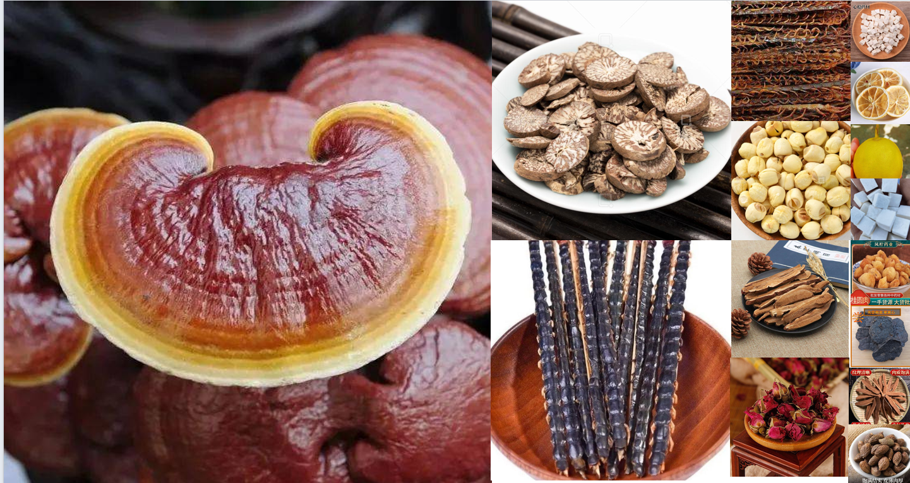

## TCM-YOLOv11 Dataset & Model

[](https://www.python.org/downloads/release/python-390/)
[](https://creativecommons.org/licenses/by/4.0/)
[]()
[]()
[]()



TCM-YOLOv11 是一个用于中药材识别与检测的高质量图像数据集与模型，结合 YOLOv11 架构进行优化，适配于药材外观检测、分类、缺陷识别等任务。

本数据集包含 **18,000 张** 中药材高清图片（分辨率 640×640），覆盖 **100+ 种常见药材**，包含不同的拍摄角度、光照、背景与遮挡情况。数据还包含丰富的附加信息标签，包括药材品种、部位、状态（干燥/新鲜）、缺陷类型等。

### 特点
- **高多样性**：涵盖不同光照条件、拍摄设备、背景及形态。
- **精细标注**：基于 COCO 格式，提供精确的边界框信息。
- **任务适配**：可直接用于目标检测、分类、实例分割等任务。

### 使用方法
1. 克隆本仓库：
   ```bash
   git clone https://github.com/yourname/tcm-yolov11.git
   cd tcm-yolov11
